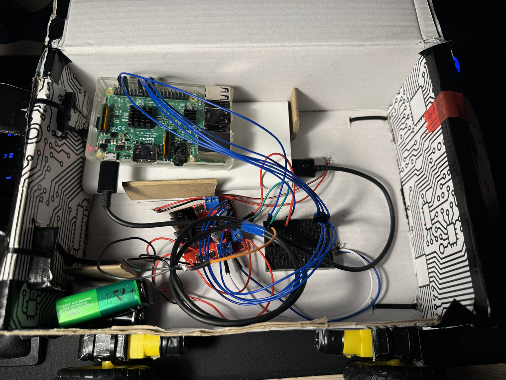
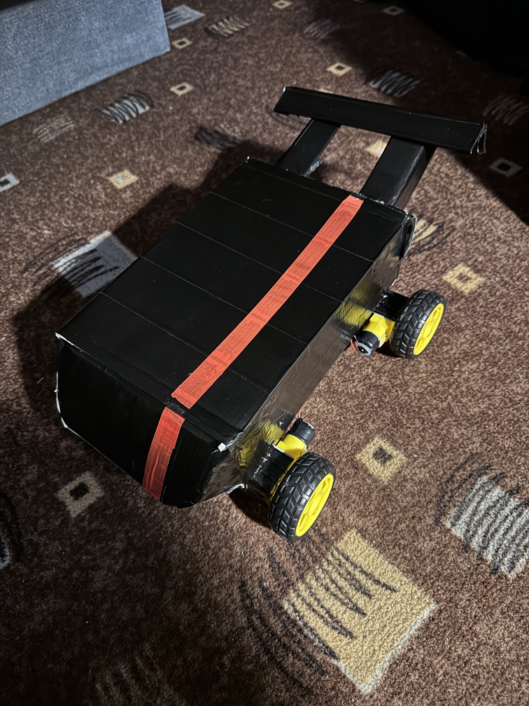

# Raspberry-car
Simple Raspberry remote controlled car for University Project.  

Raspberry is powered by powerbank, motors are powered by 2 9V batteries.  

Car is controled via SSH using raspberry pin commands, commands are send based on which key was pressed/released.

## How do things look under the hood:

## How does it look from outside

